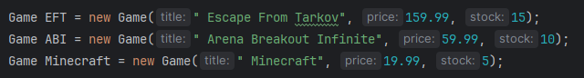
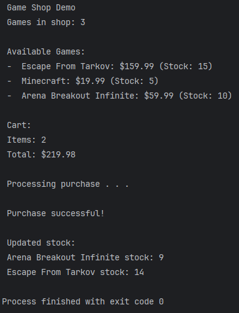
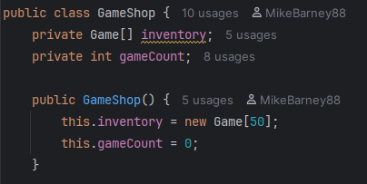

# Game Store System - QAP Project

A Java game store with shopping cart and purchase functionality.

### Author
Michael Barney - QAP 1

## Features

- Browse games in the store
- Add games to shopping cart (max 10 items)
- Remove games from cart
- Calculate cart total
- Process purchases and update stock
- Store up to 50 games in inventory

## Tests

The project includes **11 unit tests** across 3 test classes:

- **GameTest** (3 tests) - Game creation, stock decrease, validation
- **CartTest** (4 tests) - Add/remove items, calculate total
- **GameStoreTest** (4 tests) - Add games, find games, purchase processing

Tests are written in class style using:
- Assertions.assertTrue(), Assertions.assertEquals(), etc.
- public test methods
- Variables named such as gameUnderTest, cartUnderTest
- Direct comparisons using ==

### Test Coverage

**Positive Tests:**
- Create valid games
- Add and remove games from cart
- Calculate cart total
- Process purchases
- Find games in store

**Negative Tests:**
- Invalid game creation (negative price)
- Add null to cart
- Purchase with empty cart

## Dependencies
    <dependency>
        <groupId>org.junit.jupiter</groupId>
        <artifactId>junit-jupiter</artifactId>
        <version>5.13.4</version>
    </dependency>

The Dependency was found on:
  https://central.sonatype.com/artifact/org.junit.jupiter/junit-jupiter/5.13.4

## Clean Code
Below are my classes with some screenshots of how my code meets clean code practices.

- The logic is straightforward.
- The code is readable, simple and consistent.
- The functions are short and direct.
- The code has passed all testing.
- The code is easily readable.

#### Game
Represents a game with title, price, and stock.

#### Cart
Shopping cart for holding games (max 10 items).

#### GameStore
Manages inventory (max 50 games) and processes purchases.

## GitHub Actions

The project uses GitHub Actions for automated testing:

1. Push to GitHub
2. Tests run automatically on every push

## Problems Encountered

I had a little trouble getting the tests written and passing, as well for setting up the GitHub actions. 
I needed to go back and rewatch some of the class recordings to fully figure it out 
